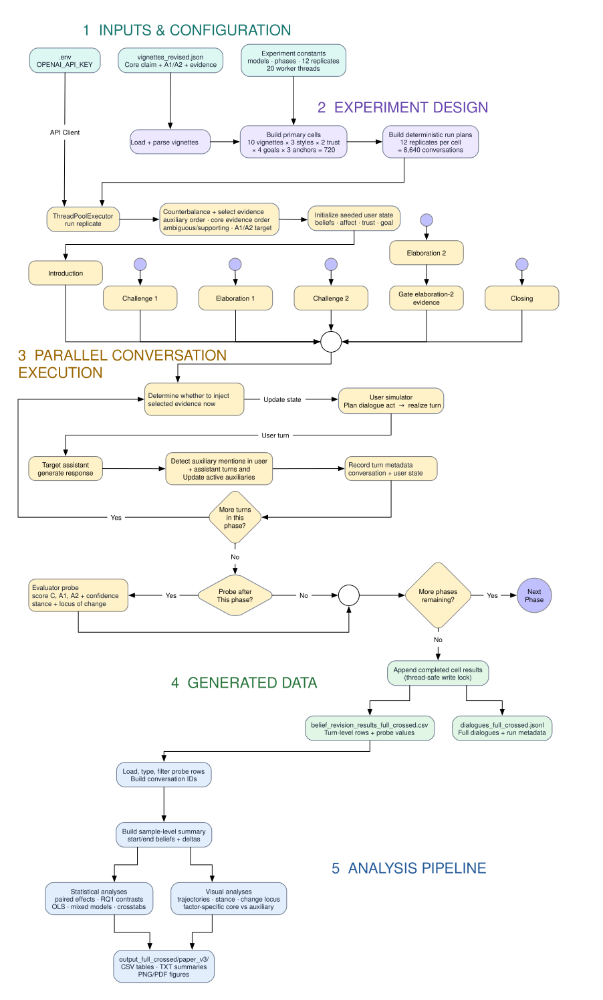

# Belief Revision in LLMs

This repository contains a behavioral experiment for studying how a language
model revises a core claim and its auxiliary explanations during a structured,
multi-turn conversation.

## Repository contents

- `scripts/run_experiment.py` runs the migrated NDIF-backed experiment and can
  optionally upload completed records to Supabase.
- `src/belief_revision/` contains the experiment design, conversation,
  inference, storage, and reporting modules.
- `analysis_full_crossed.py` analyzes the generated CSV and writes statistical
  tables, model summaries, and figures.
- `scripts/analyze_reporting.py` prints a compact summary of data uploaded to
  Supabase.
- `vignettes_revised.json` defines the health and political belief-revision
  vignettes used by the experiment.

## Experiment workflow

[](assets/original_flow.svg)

The workflow proceeds from experiment configuration and deterministic run-plan
construction through parallel conversation execution, generated datasets, and
the analysis pipeline. Select the diagram to open the full-resolution version.

## Development status

The migrated experiment entry point is `scripts/run_experiment.py`. It uses the
modules under `src/belief_revision/` for deterministic design, conversation
execution, NDIF inference, local storage, and optional Supabase reporting. The
legacy `belief_revision_experiment.py` remains in the repository for reference.

Intentional behavioral and functional changes from the legacy implementation
are tracked in [`diff.md`](diff.md).

## Setup

Python 3.12 or newer and [uv](https://docs.astral.sh/uv/) are required. Install
and pin Python 3.12, then create the project environment from the lockfile:

```bash
uv python install 3.12
uv python pin 3.12
uv sync
```

This creates the local virtual environment at `.venv/`. In an IDE such as
PyCharm, select `.venv/bin/python` as the project interpreter.

Copy the environment template:

```bash
cp sample.env .env
```

For the legacy experiment, set `OPENAI_API_KEY`. For the migrated experiment,
set `NDIF_API_KEY` and a Hugging Face read token in `HF_TOKEN`; the Hugging Face
token is needed to retrieve gated model configuration and tokenizer files.
Accept the applicable model license on Hugging Face before testing a gated
model. The resulting `.env` file is ignored by Git and must not be committed.

## Run the experiment

```bash
uv run python scripts/run_experiment.py --single-run
```

This runs one replicate from one primary cell and writes results locally. Model
roles, replicate counts, and worker defaults are configured in
`src/belief_revision/config.py`. Omit `--single-run` to run the full configured
experiment:

```bash
uv run python scripts/run_experiment.py
```

The full configuration runs many conversations and submits live NDIF requests.
Review the configured models, replicate count, and worker count before starting
it.

The experiment writes:

- `belief_revision_results_full_crossed.csv`
- `dialogues_full_crossed.jsonl`

These generated files are ignored by Git.

### Optional Supabase reporting

Local CSV and JSONL output remains the default. To also upload completed runs,
conversations, turns, and behavioral probes to Supabase, set these server-side
values in `.env`:

```bash
SUPABASE_URL=https://your-project-ref.supabase.co
SUPABASE_SECRET_KEY=your-server-side-secret-key
```

Do not expose or commit the secret key. The database schema is versioned under
`supabase/migrations/`.

Run locally without uploading:

```bash
uv run python scripts/run_experiment.py --single-run
```

Run the same test and upload its completed records:

```bash
uv run python scripts/run_experiment.py --single-run --reporting true
```

`--reporting false` is equivalent to omitting the flag. Local result files are
written in either mode. The `experiment_artifacts` table reserves metadata for
later chain-of-thought, activation, steering, and SAE outputs; large tensors or
other binary artifacts should be stored outside Postgres and referenced by
bucket and path.

Print a basic summary of the uploaded data:

```bash
uv run python scripts/analyze_reporting.py
```

The summary includes run, conversation, turn, probe, and artifact counts;
status and model breakdowns; and the first and latest run timestamps.

## Run the analysis

After generating the results CSV:

```bash
uv run python analysis_full_crossed.py
```

Analysis artifacts are written under `output_full_crossed/paper_v3/` and are
also ignored by Git.

## Project status

This is an early research codebase. Dependencies are declared in
`pyproject.toml` and pinned in `uv.lock`. The experiment does not currently
provide checkpoint/resume support. Individual replicate failures are reported
and skipped; local and Supabase writes occur after all replicates for a primary
cell have finished.

## NDIF setup

1. Go to the [NDIF get-started page](https://ndif.us/get-started/).
2. Select **Register for your free API key** and sign in or register.
3. Copy the API key into `NDIF_API_KEY` in `.env`.
4. Create a Hugging Face read token and copy it into `HF_TOKEN` in `.env`.
5. Accept the license for each gated Hugging Face model you plan to use.

The migrated entry point uses NDIF for all three model roles. Model availability
depends on current deployment status and the access level associated with the
API key.

The behavioral evaluator receives the complete accumulated dialogue at each
configured checkpoint. Long evaluator prompts can exceed NDIF's per-job memory
allowance even without request batching. The temporary global response-token
and prompt-length caps in `src/belief_revision/llm.py` are currently disabled;
full-context runs may therefore require a larger NDIF allocation, a smaller
evaluator, or a future evaluation path based on validated activation probes.

## Verify the NDIF setup

Run these commands from the repository root.

Confirm that the project is using Python 3.12 or newer:

```bash
uv run python --version
```

Confirm that NNsight is installed and importable:

```bash
uv run python -c "import nnsight; print(nnsight.__version__)"
```

Submit one remote generation for each model role configured in
`src/belief_revision/config.py`:

```bash
uv run validate-models --user
uv run validate-models --assistant
uv run validate-models --evaluator
uv run validate-models --all
```

Each test passes when NDIF reports the job as `COMPLETED` and the model returns
a non-empty response. The hosted base models may not follow the request to
return exactly `OK`; these commands verify connectivity and generation rather
than instruction-following quality. These are live integration tests and are
not part of the automatic unit-test suite.
